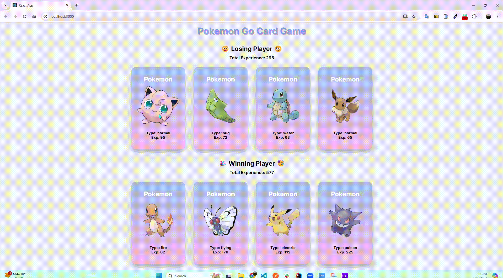
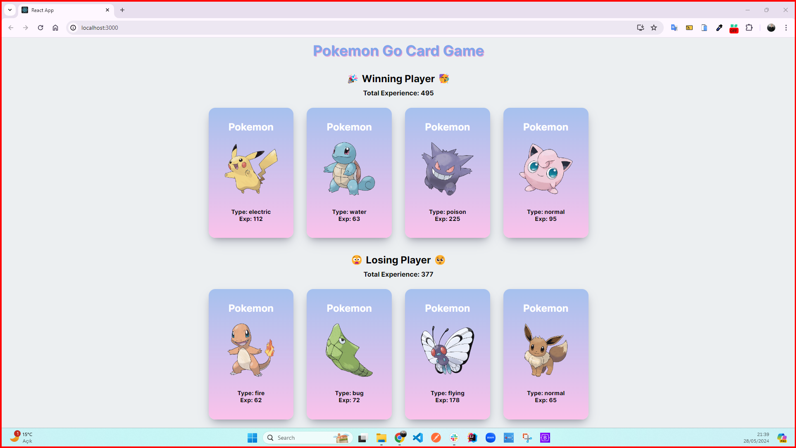
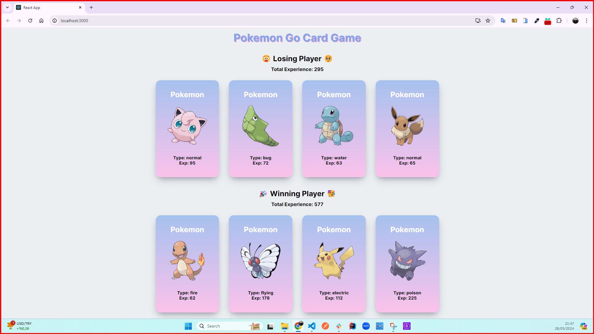

<h1>Pokemon Go Card Game Project</h1>

I present the Pokemon Go Card Game I developed with React. The Pokemon Go Card Game is based on a battle between two decks. Each deck contains different Pokemon cards, and these cards are distributed randomly. Each pokedex card contains the type of pokedex and experience values. The game page, designed with React, reflects your Pokedexes on the screen every time it is rendered and shows the total experience of the two Pokedex decks. The experience totals of the Pokedexes between two different decks are compared. Whichever deck has the higher total experience value of its Pokedexes, that deck wins the game!

<h2> The following technologies were used in the frontend development phase of my site: </h2>

- HTML5
- CSS3
- API
- React

<h4>GIF</h4>

<h4>IMAGES</h4>

